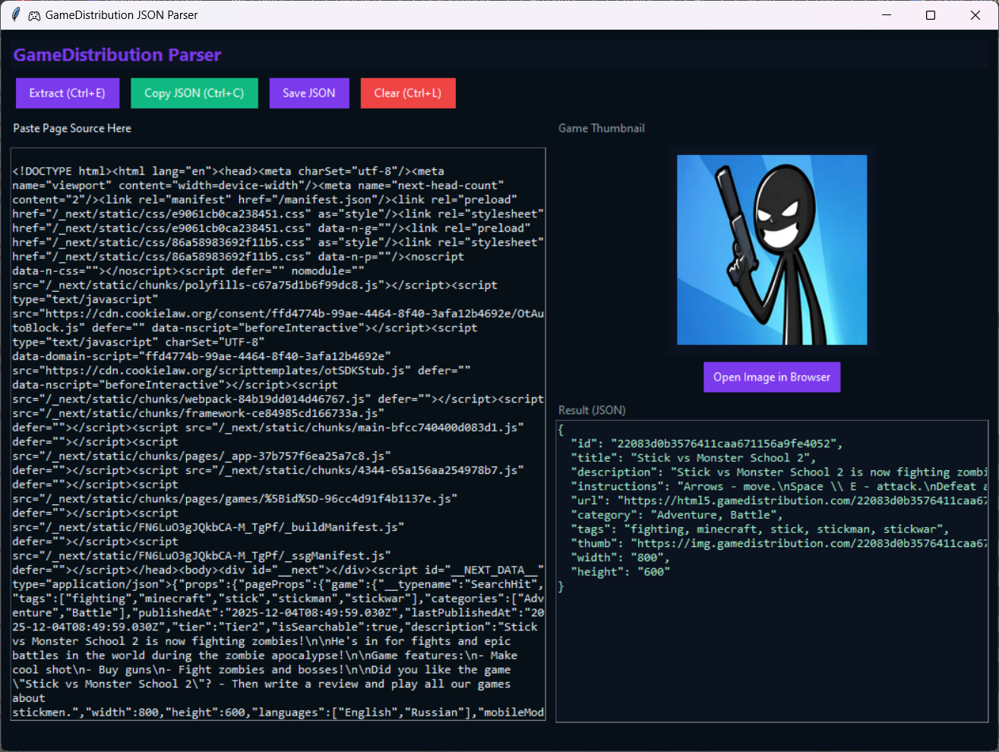

# GameDistribution Page Source Parser
A modern desktop GUI tool for extracting structured JSON data from GameDistribution HTML game pages. Press Ctrl + U on any game page, copy the entire source code, paste it into the app, and the tool automatically parses all available metadata. This project is especially useful for developers who manage game libraries or run platforms that depend on consistent metadata, including setups similar to [Plinkod.com](https://plinkod.com) where fast extraction and clean data organization are essential.

## Preview


## Features
- Extracts full game metadata: ID, title, description, instructions, categories, tags, width, height, thumbnail URL, and game launch URL
- Dark modern UI built with Tkinter
- Thumbnail preview (if Pillow is installed)
- JSON copy to clipboard and save to file
- Auto-detection for missing optional libraries
- Keyboard shortcuts: Ctrl+E (Extract), Ctrl+C (Copy JSON), Ctrl+L (Clear)


## Prerequisites

- Python 3.x
- Internet connection (for fetching thumbnails)

## Installation

1.  **Clone the repository**:
    ```bash
    git clone https://github.com/yourusername/game-distribution-json.git
    cd game-distribution-json
    ```

2.  **Install dependencies**:
    ```bash
    pip install -r requirements.txt
    ```

## Usage

1.  Run the application:
    ```bash
    python app.py
    ```

2.  Open any game page on GameDistribution
3.  Press Ctrl + U in your browser to show the page source
4.  Copy all the source code
5.  Paste the source into the left panel
6.  Click Extract (or Ctrl+E)
7.  The JSON data will appear in the right panel with an optional thumbnail preview
8.  Copy or save the JSON as needed

## Dependencies

- `tkinter` (Standard Python GUI library)
- `beautifulsoup4` (For HTML parsing)
- `pyperclip` (For clipboard operations)
- `Pillow` (For image processing)

## License

This project is licensed under the MIT License.
